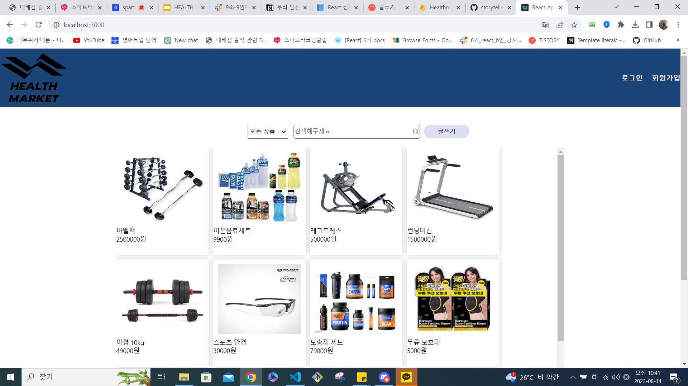
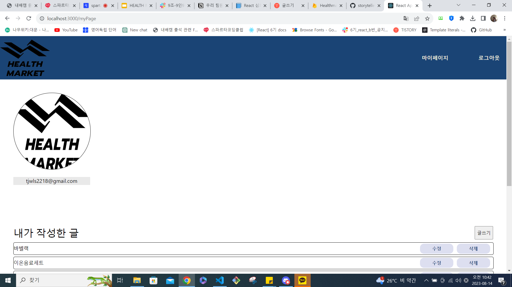
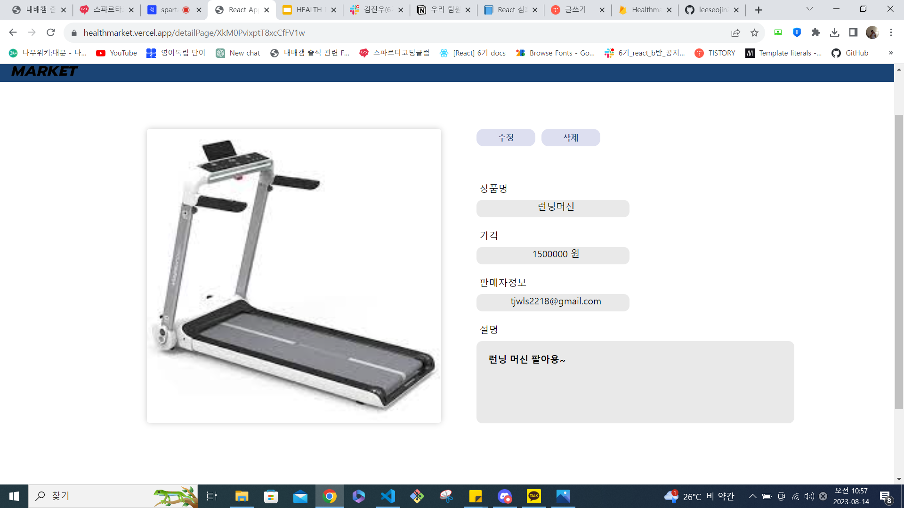
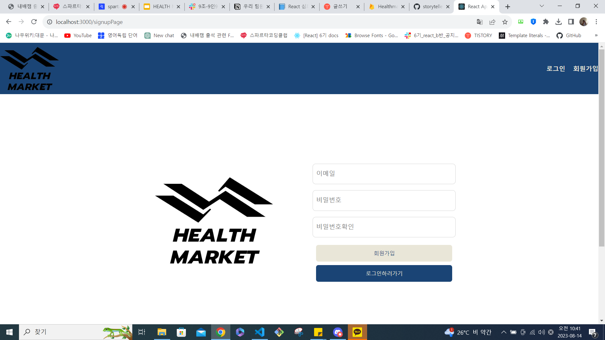
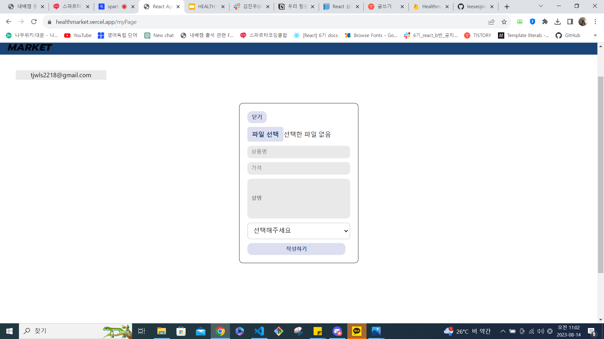

- # 프로젝트

  아웃소싱 프로젝트

  프로젝트 이름 : 헬스 마켓

  프로젝트 내용 : 피트니스 시대에 맞춰 사용자가 원하는 헬스 전용 물품들을 사고 팔 수 있는 중고 거래 사이트

  기능 소개 요약: 파이어베이스를 활용하여 드라마 추천 페이지를 구성하였습니다.

  프로젝트 목표 : 핵심 기능 이해 및 마감시간 전 완성.

- # 팀원 소개

이서진 ENFJ https://blossomflower2214.tistory.com/https://github.com/leeseojin221  
박지환 INFP https://orasio.tistory.com/https://github.com/orasio3477  
조인재 ISTP https://tnrnr910.tistory.com/manage/posts/ https://github.com/tnrnr910  
김진우 ENTP https://velog.io/@wlsdn090909 https://github.com/orasio3477  
김의진 INFP https://velog.io/@palpalkim https://github.com/kimpalpal  

- # 페이지 소개

  1. Main 페이지: 상품이 나열되는 페이지 입니다. 
  2. MyPage 페이지: 나의 정보와 글 목록이 뜹니다. 
  3. Detail 페이지: 카드를 누르면 상품 세부 내용을 확인할 수 있습니다. 
  4. Login 페이지: 로그인과 회원가입 페이지 입니다. 
  5. Edit 페이지: 페이지 소개 페이지입니다. 
  6. Write 페이지: 에디터가 글을 작성할 수 있는 페이지입니다. 
